# Domain-Focused RAG Chatbot

A specialised chatbot project for Sprint 2 using Next.js, LangChain, advanced RAG, and tool calling.  
The goal is to provide context-aware, domain-specific answers with practical tool integrations.

**Live demo:** [https://chat.nk-studio.org/](https://chat.nk-studio.org/)

---

## For reviewers

### Chosen Domain / Use Case (Hair Salon - chatbot)

This project's domain is a hair salon assistant that helps users with:

- Service questions (what's included, typical duration, what to expect)
- Pricing questions (prices and how final price can depend on hair length/density)
- Appointment planning (checking availability and booking an appointment)
- Hairstyle recommendations (based on hair type and desired outcome)
- Aftercare / hair care guidance and basic DUK (common "how long / how to prepare" questions)

### Chosen domain / use case (hair salon — NK Studio)

The assistant covers service and pricing questions, booking guidance (online booking not live — contact studio), stylist info (Natallia Khatsei), and care / FAQ topics from ingested markdown under `data/hair-salon/`.

**Implemented tool calling (domain-relevant):**

- `check_stylist_availability` — `src/lib/tools/checkStylistAvailability.ts`
- `get_service_price` — `src/lib/tools/getServicePrice.ts` (reads `data/hair-salon/pricing/pricing.md`)
- `suggest_appointment_slots` — `src/lib/tools/suggestAppointmentSlots.ts` (policy/hours from `booking-policy.md`)

**Knowledge sources (RAG):**

- `data/hair-salon/`

### Deployment model (single salon per deployment)

- One salon per deployed instance; one Supabase project per salon.
- Ingestion reads markdown from `data/`; convert PDF/Word/web to markdown before ingest.
- **Vercel:** set `OPENAI_API_KEY`, optional `ANTHROPIC_API_KEY` if offering Claude models, `SUPABASE_URL`, `SUPABASE_SERVICE_ROLE_KEY`, and `INGEST_API_KEY` (for ingest route). `.env.local` is not deployed.

### Scope / current status (summary)

- Implemented: UI (`/` on `chat.nk-studio.org`), shell with model selector (`Sidebar` / `ChatComposer`), wired chat to `/api/chat`, citations, tool blocks, token usage + estimated cost per message and per session (`ChatView`).
- Implemented: Supabase health (`GET /api/health/supabase`), RAG ingest (`POST /api/rag/ingest`), `pnpm ingest:local`.
- Implemented: LangChain pipeline, query rewrite, three Zod tools, telemetry (including token totals on successful chat), OpenAI + optional Anthropic chat via `createSalonChatModel`.
- Not implemented / stretch: multi-turn memory, moderation API, automated tests, persisted history + export (JSON/CSV/PDF).

### Architecture: classic RAG + tool round (flowchart)

<details>
<summary>⬇️ <strong>Show pipeline diagram</strong> (SVG)</summary>



Source: `docs/assets/rag_chatbot_classic_flowchart.svg`

</details>

## Task requirements

### Core requirements

- ✅ 1. **RAG Implementation:**
  - ✅ Create a knowledge base relevant to your domain
    - Created a domain knowledge base under `data/hair-salon/`
  - ✅ Implement standard document retrieval with embeddings
    - Implemented secure ingestion (`POST /api/rag/ingest`) with chunking and OpenAI embeddings

    <details>
      <summary>⬇️ Example: ingest API (Bearer auth, chunking defaults)</summary>

    ```bash
    # Same flow as `pnpm ingest:local` — see scripts/ingest-local.mjs
    curl -sS -X POST "http://localhost:3000/api/rag/ingest" \
      -H "Content-Type: application/json" \
      -H "Authorization: Bearer $INGEST_API_KEY" \
      -d '{
        "dataDirectory": "data/hair-salon",
        "embeddingModel": "text-embedding-3-small",
        "chunkSize": 1200,
        "chunkOverlap": 200,
        "replaceExisting": true
      }'
    ```

    </details>

  - ✅ Use chunking strategies and similarity search
    - Vector retrieval via `match_rag_chunks` in `retrieveRelevantChunks`; query rewrite in `runSalonPipeline` (`src/lib/rag/queryRewrite.ts`); citations in API and `ChatView`

    <details>
      <summary>⬇️ See source snippet from <code>src/lib/rag/retrieval.ts</code></summary>

    ```ts
    const queryEmbedding = await embedQueryText(query, options.embeddingModel);
    const { data, error } = await supabase.rpc("match_rag_chunks", {
      query_embedding: queryEmbedding,
      match_count: options.matchCount,
    });
    ```

    </details>

- ✅ 2. **Tool Calling:**
  - ✅ Implement at least 3 different tool calls
    - `checkStylistAvailability`, `getServicePrice`, `suggestAppointmentSlots` in `src/lib/tools/`; orchestration in `salonToolRound.ts`

    <details>
      <summary>⬇️ Example: register tools and bind them to the chat model</summary>

    ```ts
    // src/lib/tools/salonToolRound.ts
    const SALON_TOOLS = [
      checkStylistAvailabilityTool,
      getServicePriceTool,
      suggestAppointmentSlotsTool,
    ] as const;

    const llm = createSalonChatModel();
    const bound = llm.bindTools([...SALON_TOOLS], { tool_choice: "auto" });
    // ... model invokes tools; server runs TOOL_BY_NAME[call.name].invoke(...)
    ```

    </details>

    <details>
      <summary>⬇️ Example: one tool with Zod input schema (LangChain <code>tool</code>)</summary>

    ```ts
    // src/lib/tools/getServicePrice.ts (pattern repeated per tool)
    const getServicePriceSchema = z.object({
      serviceName: z.string().min(1).describe("Service the guest asked about."),
    });

    export const getServicePriceTool = tool(
      async ({ serviceName }) => {
        /* load pricing.md, return JSON string for the model */
      },
      {
        name: "get_service_price",
        description:
          "Load the NK Studio EUR price list when the user asks for costs.",
        schema: getServicePriceSchema,
      },
    );
    ```

    </details>

  - ✅ Functions should be relevant to your domain
    - Availability, pricing (reads `pricing.md`), suggested slots (reads `booking-policy.md`)
  - ✅ Schema validation and UI integration
    - Zod schemas per tool; tool results in `POST /api/chat` response and dedicated section in `ChatView`

    <details>
      <summary>⬇️ Example: validate chat request and return <code>toolResults</code></summary>

    ```ts
    // src/app/api/chat/route.ts
    const requestSchema = z.object({
      message: z.string().trim().min(1).max(2000),
      topK: z.number().int().min(1).max(8).default(4),
    });

    const body = await request.json().catch(() => ({}));
    const parsedBody = requestSchema.safeParse(body);
    // ...
    const pipeline = await runSalonPipeline({ message, topK });
    return NextResponse.json({
      ok: true,
      answer: pipeline.answer,
      citations: pipeline.citations,
      toolResults: pipeline.toolResults,
    });
    ```

    </details>

    <details>
      <summary>⬇️ Example: render tool outputs in <code>ChatView</code></summary>

    ```tsx
    // src/components/chatbot/views/ChatView.tsx
    {
      msg.toolResults && msg.toolResults.length > 0 ? (
        <div className="rounded-xl border border-[#48484b]/25 bg-[#0e0e0f]/80 p-4 space-y-2 shadow-inner">
          <p className="text-[10px] font-label uppercase tracking-widest text-[#c6c6cd] font-bold">
            Tool calls (metadata)
          </p>
          <ul className="space-y-2 text-xs text-on-surface-variant font-mono break-words">
            {msg.toolResults.map((t, idx) => (
              <li key={`${msg.id}-tool-${idx}`}>
                <span className={t.ok ? "text-[#4edea3]" : "text-[#ee7d77]"}>
                  {t.name}
                </span>
                <pre className="mt-1 text-[11px] whitespace-pre-wrap opacity-90">
                  {t.output}
                </pre>
              </li>
            ))}
          </ul>
        </div>
      ) : null;
    }
    ```

    </details>

- ✅ 3. **Domain Specialisation:**
  - ✅ Choose a specific domain or use case
    - Hair salon domain is defined and documented
  - ✅ Create a focused knowledge base
    - Domain-focused knowledge base exists under `data/hair-salon/`
  - ✅ Implement domain-specific prompts and responses
    - `src/lib/llm/chat.ts` — `buildGroundedInstructions`, grounded XML blocks (`<retrieved_context>`, `<tool_results>`, `<user_message>`), basic injection guardrails
  - ✅ Add relevant security measures for your domain
    - Ingest auth, path traversal protection, input validation, chat rate limiting

    <details>
      <summary>⬇️ Example: ingest — Bearer auth + <code>data/</code>-only path + traversal guard</summary>

    ```ts
    // src/app/api/rag/ingest/route.ts
    const requestSchema = z
      .object({
        dataDirectory: z
          .string()
          .trim()
          .regex(
            /^data(?:[\\/][a-zA-Z0-9_-]+)*$/,
            "dataDirectory must stay inside the data/ directory.",
          )
          .default("data/hair-salon"),
        // ...
      })
      .superRefine((value, context) => {
        const pathParts = value.dataDirectory.split(/[\\/]/);
        if (pathParts.includes("..") || pathParts.includes(".")) {
          context.addIssue({
            code: z.ZodIssueCode.custom,
            message: "dataDirectory cannot contain path traversal segments.",
            path: ["dataDirectory"],
          });
        }
      });

    getRequiredEnv("INGEST_API_KEY");
    if (!isAuthorizedIngestRequest(request)) {
      return NextResponse.json(
        { ok: false, error: "Unauthorized ingest request." },
        { status: 401 },
      );
    }
    ```

    </details>

    <details>
      <summary>⬇️ Example: chat — per-client rate limit + Zod body</summary>

    ```ts
    // src/app/api/chat/route.ts
    const RATE_LIMIT_WINDOW_MS = 60_000;
    const RATE_LIMIT_MAX_REQUESTS = 20;

    const clientKey = getClientKey(request);
    if (!isRequestAllowed(clientKey)) {
      return NextResponse.json(
        {
          ok: false,
          error: "Rate limit exceeded. Please wait a minute and retry.",
        },
        { status: 429 },
      );
    }

    const body = await request.json().catch(() => ({}));
    const requestSchema = z.object({
      message: z.string().trim().min(1).max(2000),
      topK: z.number().int().min(1).max(8).default(4),
    });
    const parsedBody = requestSchema.safeParse(body);
    ```

    </details>

- ✅ 4. **Technical Implementation:**
  - ✅ Use LangChain for OpenAI API integration
    - `RunnableSequence` in `src/lib/llm/salonPipeline.ts`; `createSalonChatModel`; tool round with LangChain messages

    <details>
      <summary>⬇️ Example: <code>RunnableSequence</code> pipeline (<code>salonPipeline.ts</code>)</summary>

    ```ts
    const chain = RunnableSequence.from([
      RunnableLambda.from(async (state) => {
        const retrievalQuery = await rewriteQueryForRetrieval(state.message);
        return { ...state, retrievalQuery };
      }),
      RunnableLambda.from(async (state) => {
        const chunks = await retrieveRelevantChunks(
          state.retrievalQuery ?? state.message,
          {
            embeddingModel: "text-embedding-3-small",
            matchCount: state.topK,
          },
        );
        return { ...state, chunks };
      }),
      RunnableLambda.from(async (state) => {
        const toolResults = await runSalonToolRound(state.message);
        const toolContext = formatToolResultsForPrompt(toolResults);
        return { ...state, toolResults, toolContext };
      }),
      RunnableLambda.from(async (state) => {
        const chunks = state.chunks ?? [];
        const answer = await generateGroundedAnswer(
          state.message,
          chunks,
          state.toolContext,
        );
        const citations = chunks.map((c) => ({
          source: c.source,
          similarity: c.similarity,
          excerpt: c.content.slice(0, 180),
        }));
        return {
          answer,
          retrievalQuery: state.retrievalQuery ?? state.message,
          chunks,
          citations,
          toolResults: state.toolResults ?? [],
        };
      }),
    ]);
    return chain.invoke(input);
    ```

    </details>

  - ✅ Implement proper error handling
    - Typed/safe JSON error responses from API routes

    <details>
      <summary>⬇️ Example: validation vs server error shapes (<code>POST /api/chat</code>)</summary>

    ```ts
    if (!parsedBody.success) {
      return NextResponse.json(
        {
          ok: false,
          error: "Invalid request payload.",
          details: parsedBody.error.flatten(),
        },
        { status: 400 },
      );
    }
    // ...
    return NextResponse.json({ ok: false, error: errText }, { status: 500 });
    ```

    </details>

  - ✅ Add logging and monitoring
    - Privacy-safe JSON telemetry in `src/lib/logging/chatTelemetry.ts` (latency, counts; no full user message content)

    <details>
      <summary>⬇️ Example: telemetry helper + chat success event</summary>

    ```ts
    // src/lib/logging/chatTelemetry.ts
    export function logChatTelemetry(
      event: string,
      fields: Record<string, string | number | boolean>,
    ): void {
      console.info(JSON.stringify({ event, t: Date.now(), ...fields }));
    }

    // src/app/api/chat/route.ts
    logChatTelemetry("chat_ok", {
      ms: Date.now() - started,
      messageLen: message.length,
      citationCount: pipeline.citations.length,
      toolInvocationCount: pipeline.toolResults.length,
      chunkCount: pipeline.chunks.length,
    });
    ```

    </details>

  - ✅ Include user input validation
    - Zod on `POST /api/rag/ingest` and `POST /api/chat`

    <details>
      <summary>⬇️ Example: <code>safeParse</code> on both chat and ingest</summary>

    ```ts
    const parsedBody = requestSchema.safeParse(body);
    if (!parsedBody.success) {
      return NextResponse.json(
        {
          ok: false,
          error: "Invalid request payload.",
          details: parsedBody.error.flatten(),
        },
        { status: 400 },
      );
    }
    ```

    </details>

  - ✅ Implement rate limiting and API key management
    - In-memory chat rate limiting; server secrets via `.env.local` (local) and Vercel env (production)

    <details>
      <summary>⬇️ Example: chat rate limit + required env reads</summary>

    ```ts
    // src/app/api/chat/route.ts — per-client key, fixed window
    if (!isRequestAllowed(clientKey)) {
      return NextResponse.json(
        {
          ok: false,
          error: "Rate limit exceeded. Please wait a minute and retry.",
        },
        { status: 429 },
      );
    }

    // src/lib/env.ts — fail fast if a server secret is missing
    export function getRequiredEnv(name: string): string {
      const value = process.env[name];
      if (!value || value.trim().length === 0) {
        throw new Error(`Missing required environment variable: ${name}`);
      }
      return value;
    }
    ```

    </details>

  - ✅ OpenAI client resilience
    - Timeout and limited retries in `src/lib/llm/openaiClient.ts` / `modelConfig.ts`

    <details>
      <summary>⬇️ Example: singleton client with timeout + retries</summary>

    ```ts
    // src/lib/llm/openaiClient.ts
    cachedClient = new OpenAI({
      apiKey: getRequiredEnv("OPENAI_API_KEY"),
      timeout: OPENAI_TIMEOUT_MS,
      maxRetries: 1,
    });
    ```

    </details>

- ✅ 5. **User Interface:**
  - ✅ Create an intuitive interface using Streamlit or Next.js
    - Responsive Next.js chat UI: routes, shell, `ChatComposer`, `ChatView`
  - ✅ Show relevant context and sources
    - Citations from retriever metadata in `ChatView`
  - ✅ Display tool call results
    - Tool block (before assistant reply) in `ChatView`
  - ✅ Include progress indicators for long operations
    - Loading state while `/api/chat` request is in flight

## Optional tasks

### Easy

- [ ] 1. Add conversation history and export functionality
  - _TODO:_ Persist session chat history locally. Add export options (JSON first, then CSV/PDF if time allows)

- ✅ 3. Include source citations in responses
  - Implemented: citations from API rendered in `ChatView` (sources / similarity)

### Medium

- ✅ 1. Implement multi-model support (OpenAI, Anthropic, etc.)
  - Implemented: selector in `ChatComposer` (mobile) and `Sidebar` (desktop), validated `modelId` in `POST /api/chat`, and provider-aware model creation in `createSalonChatModel`
  - _Sprint vs. product:_ multi-model is here for the assignment; for a real salon consultant usually one model would be used.

    <details>
      <summary>⬇️ Example: Zod <code>modelId</code> + Anthropic env check (<code>src/app/api/chat/route.ts</code>)</summary>

    ```ts
    const requestSchema = z.object({
      message: z.string().trim().min(1).max(2000),
      topK: z.number().int().min(1).max(8).default(4),
      modelId: z.enum(SUPPORTED_MODEL_IDS).default(DEFAULT_MODEL_ID),
    });

    const { message, topK, modelId } = parsedBody.data;
    if (modelId.startsWith("anthropic:")) {
      try {
        getRequiredEnv("ANTHROPIC_API_KEY");
      } catch {
        return NextResponse.json(
          {
            ok: false,
            error:
              "Anthropic model selected, but ANTHROPIC_API_KEY is missing on the server.",
          },
          { status: 500 },
        );
      }
    }

    const pipeline = await runSalonPipeline({ message, topK, modelId });
    ```

    </details>

    <details>
      <summary>⬇️ Example: provider switch in <code>createSalonChatModel.ts</code></summary>

    ```ts
    const selected = MODEL_CATALOG[modelId];

    if (selected.provider === "anthropic") {
      return new ChatAnthropic({
        model: selected.model,
        temperature,
        maxRetries: 1,
        clientOptions: { timeout: OPENAI_TIMEOUT_MS },
      });
    }

    return new ChatOpenAI({
      model: selected.model,
      temperature,
      timeout: OPENAI_TIMEOUT_MS,
      maxRetries: 1,
    });
    ```

    </details>

    <details>
      <summary>⬇️ Example: <code>POST /api/chat</code> body with <code>modelId</code></summary>

    ```json
    {
      "message": "What does a cut cost?",
      "topK": 4,
      "modelId": "openai:gpt-4.1-mini"
    }
    ```

    </details>

- ✅ 5. Calculate and display token usage and costs
  - Implemented: usage metadata aggregated in pipeline (`rewrite + tool round + final answer`) and rendered per-message/session in `ChatView`

    <details>
      <summary>⬇️ Example: aggregate usage + <code>estimateCostUsd</code> (<code>src/lib/llm/salonPipeline.ts</code>)</summary>

    ```ts
    const totalUsage = sumTokenUsage(
      state.usage ?? { inputTokens: 0, outputTokens: 0, totalTokens: 0 },
      grounded.usage,
    );

    return {
      answer: grounded.answer,
      // ...
      usage: {
        modelId: state.modelId,
        inputTokens: totalUsage.inputTokens,
        outputTokens: totalUsage.outputTokens,
        totalTokens: totalUsage.totalTokens,
        estimatedCostUsd: estimateCostUsd(totalUsage, state.modelId),
      },
    };
    ```

    </details>

    <details>
      <summary>⬇️ Example: include <code>usage</code> in JSON + session rollup in <code>ChatView.tsx</code></summary>

    ```ts
    // src/app/api/chat/route.ts — success body (trimmed)
    return NextResponse.json({
      ok: true,
      answer: pipeline.answer,
      citations: pipeline.citations,
      toolResults: pipeline.toolResults,
      usage: pipeline.usage,
    });

    // src/components/chatbot/views/ChatView.tsx — sum assistant rows for “Session usage”
    const sessionUsage = useMemo(() => {
      return messages.reduce(
        (acc, message) => {
          if (message.role !== "assistant" || !message.usage) return acc;
          return {
            inputTokens: acc.inputTokens + message.usage.inputTokens,
            outputTokens: acc.outputTokens + message.usage.outputTokens,
            totalTokens: acc.totalTokens + message.usage.totalTokens,
            estimatedCostUsd:
              acc.estimatedCostUsd + message.usage.estimatedCostUsd,
          };
        },
        {
          inputTokens: 0,
          outputTokens: 0,
          totalTokens: 0,
          estimatedCostUsd: 0,
        },
      );
    }, [messages]);
    ```

    </details>

### Hard

- ✅ 1. Deploy to cloud with proper scaling
  - Deployed on Vercel with env var configuration; deeper scaling/hardening still optional

- [ ] 6. Add multi-language support
  - _TODO:_ Add language detection, localized prompts, and translated response templates for core salon flows
